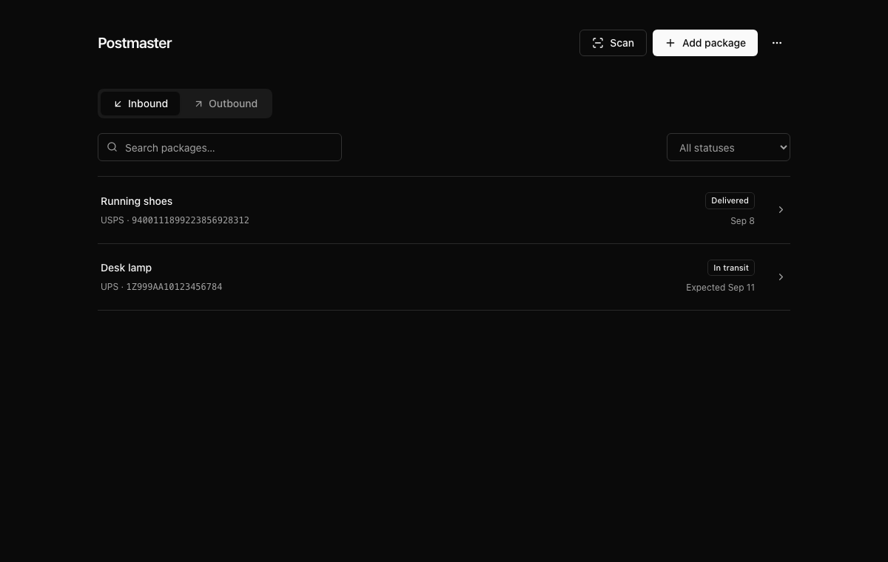
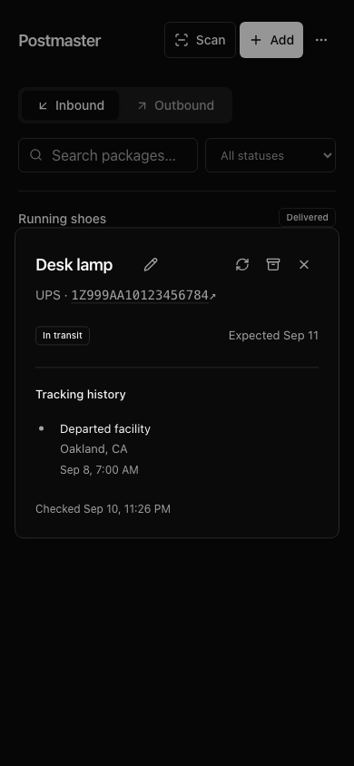
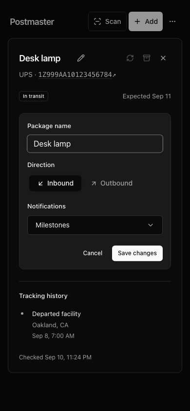

# Postmaster

Local-first package tracking with a private Tailnet dashboard, Mac menu bar app, and iPhone PWA. Package data lives in SQLite on your own server. EasyPost checks run every minute; Photon delivers iMessage updates; an optional isolated OpenClaw agent uses Z.ai GLM-5.3-Flash for conversational requests.

## Screenshots

Screenshots use demo packages, with no live shipment data.



<p>
  
  
</p>

## Use

Choose **Inbound** for packages you are receiving or **Outbound** for packages you are sending. Add a tracking number and optional name in the dashboard or Mac app. In the dashboard and PWA, the pencil beside the package name opens a modal editor for its name, direction, and notifications. The tracking view stays in place behind a dimmed backdrop. **Save changes** applies all edits; **Cancel**, Escape, or clicking outside discards them. Refresh and archive stay in the detail toolbar, with delayed tooltips explaining each glyph.

The tracking number links directly to USPS, UPS, FedEx, OnTrac, or DHL, marked with ↗. Select OnTrac or DHL explicitly when automatic detection is ambiguous. DHL divisions and Other carrier use EasyPost auto-detection; Other opens the EasyPost tracking page when available, or offers a tracking-number copy button. FedEx standalone tracking uses EasyPost’s shared `FedExDefault` integration; the `FedEx` identifier selects the personal carrier-account integration instead. Choose **Milestones**, **Detailed**, or **Muted** alerts in the package editor. Milestones cover delivery, pickup, and problems; detailed mode includes scans and ETA changes.

Text your Postmaster Photon conversation a tracking number, `add <number> [carrier] [name]`, `status`, or `help`. You can also ask questions naturally, rename packages, and change notification preferences. Only the configured recipient's direct messages are accepted. Routine tracking and notifications continue if the language model is unavailable.

The dashboard uses monochrome shadcn/ui components on desktop and mobile. On iPhone, open it in Safari over the Tailnet, then use **Share → Add to Home Screen**. The app shell opens offline; viewing and changing packages requires a connection. The service worker never stores package API responses.

Use **Scan** to read a shipping barcode with the camera or choose a label photo. Decoding happens on your device; photos are not uploaded. Code 128, Code 39, ITF, PDF417, and tracking-number QR payloads are supported. Scanned numbers appear in the form for review before adding. Use the tracking barcode rather than a retailer or routing-only barcode. Camera access requires HTTPS (the Tailnet URL provides it) or localhost; allow access when prompted.

## Development

Dates follow one rule throughout Postmaster: delivery estimates are carrier calendar dates and never shift with timezone. Scan times use the carrier's explicit offset and display in the device's current timezone, including the correct daylight-saving abbreviation. Scans without a reliable offset are labelled **carrier time (timezone unavailable)** rather than being assigned a guessed timezone. System timestamps such as **Checked** and **Last synced** use device-local time. iMessage dates remain calendar dates; the assistant must label scan times and never infer the phone's timezone from the server.

Requires Node 24 and npm. Provider credentials are optional for UI development; packages can be saved while EasyPost is unconfigured.

```sh
npm ci
npm run dev       # API: http://127.0.0.1:8765
npm run dev:web   # Vite frontend with /api proxy
npm run check    # Type checks, tests, production build
npx playwright install chromium
npm run test:e2e # Browser tests against an isolated, provider-free database
# Optional Safari-engine checks:
npx playwright install webkit
npx playwright test --config playwright.webkit.config.ts
# Refresh README screenshots using an isolated demo database:
UPDATE_SCREENSHOTS=1 npx playwright test tests/readme-capture.spec.ts
```

Copy `.env.example` to `.env` for deployment. Secrets are git-ignored and should be owner-readable only (`chmod 600 .env`). Local dev intentionally does not automatically load production credentials. To run with an explicit environment file, use `node --env-file=.env --import tsx server/index.ts`; `OWNER_LOGIN` enforces Tailscale-proxy access when set. Keep the local development listener on loopback when disabling that identity check.

## Deployment

Clone this repository onto your server and configure `.env` before starting the services. The dashboard is self-hosted; there is no public hosted instance.

```sh
docker compose -p postmaster-tracker -f deploy/compose.yaml --profile assistant up -d --build
docker compose -p postmaster-tracker -f deploy/compose.yaml --profile assistant ps
tailscale serve --bg --https=8443 http://127.0.0.1:8765
```

The server publishes only `127.0.0.1:8765`; Tailscale Serve terminates HTTPS and injects the owner's identity. Open the HTTPS URL returned by Tailscale Serve, and set `PUBLIC_URL` to that address. OpenClaw has no published port and uses an authenticated private gateway. Its provider is the individual Coding Plan endpoint, `glm-5.3-flash`, with no fallback provider. Only eight Postmaster tools are enabled; heartbeat and general memory tooling are disabled.

The Compose environment uses `EASYPOST_API_KEY`, `SPECTRUM_PROJECT_ID`, `SPECTRUM_PROJECT_SECRET`, `IMESSAGE_RECIPIENT` (E.164 or iMessage email), `ZAI_API_KEY`, `OWNER_LOGIN`, `PUBLIC_URL`, `INTERNAL_TOKEN`, `OPENCLAW_GATEWAY_TOKEN`, and `OPENCLAW_BASE_URL`. Database and assistant state live in named volumes. Stop with `docker compose ... stop`; avoid `down -v`, which removes data volumes.

## API

All application endpoints use `/api/v1`; JSON interfaces are in [shared/types.ts](shared/types.ts).

| Method | Path | Purpose |
| --- | --- | --- |
| GET | `/packages?archived=all` | List packages (`true`/`false` filters archive state) |
| POST | `/packages` | Add `{items:[{trackingNumber,carrier?,name?,direction?}]}`; per-row results |
| GET | `/packages/:id` | Package and timeline |
| PATCH | `/packages/:id` | Change name, direction, notificationMode, or archived |
| POST | `/packages/:id/refresh` | Retrieve the existing tracker |
| GET | `/notifications` | Delivery history |
| POST | `/notifications/:id/retry` | Retry an unsent message |
| GET | `/export.csv` | Export packages |
| GET | `/health` | Integration status and queue counts |

`/healthz` is a minimal unauthenticated liveness check. The internal OpenClaw client authenticates with the server-only bearer token. Browser clients use the owner identity supplied by Tailscale Serve, with same-origin mutation checks.

## Mac app

```sh
./macos/build-app.sh
open ~/Applications/Postmaster.app
```

Requires Xcode Command Line Tools and macOS 13+. The build installs an ad-hoc signed personal app at `~/Applications/Postmaster.app`; set `POSTMASTER_APP_OUTPUT` to choose another location. It supports quick add, active shipment summaries, refresh, dashboard links, per-server offline viewing, and optional launch at login. Provider credentials remain on the server.

## Backups and recovery

The backup container creates a consistent SQLite snapshot daily and retains seven days. To back up immediately:

```sh
docker compose -p postmaster-tracker -f deploy/compose.yaml run --rm backup node deploy/backup.mjs
```

Restore while writers are stopped:

```sh
docker compose -p postmaster-tracker -f deploy/compose.yaml stop postmaster backup
docker compose -p postmaster-tracker -f deploy/compose.yaml run --no-deps --rm \
  -e POSTMASTER_RESTORE_CONFIRMED=1 backup \
  node deploy/restore.mjs /backups/postmaster-<timestamp>.db
docker compose -p postmaster-tracker -f deploy/compose.yaml up -d postmaster backup
```

Rollback uses a previous image and, if required for schema compatibility, its matching backup. OpenClaw state is separate; the deployment generator reconstructs its configuration from environment settings and repository-owned plugin code.

A small dashboard footer shows recorded EasyPost tracking spend in USD, net of reported refunds. Fee snapshots are persisted once per tracker in SQLite and updated during tracking checks; archived packages remain included. This covers trackers recorded by Postmaster, not unrelated EasyPost account charges.
